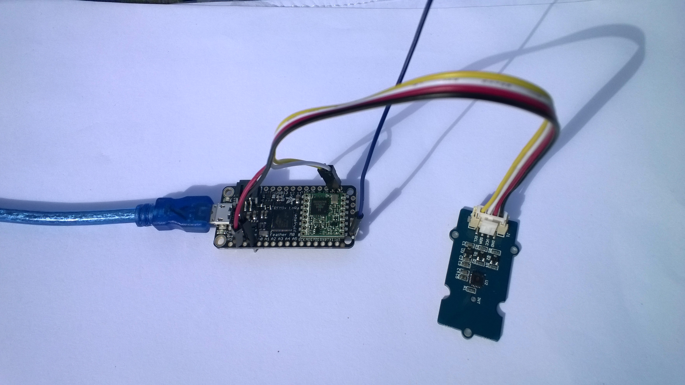

# FieldGateway.LoRa.AdafruitFeatherM0Client
Sample Adafruit Feather M0 client for my Windows 10 IoT Core [LoRa](https://lora-alliance.org/) field gateway projects

My Adafruit Feather M0 client uses
* [Adafruit Feather M0 with RFM95 900MHz LoRa Radio](https://www.adafruit.com/product/3178)
* [SeeedStudio Grove-Temperature & Humidity Sensor ](https://www.seeedstudio.com/Grove-Temperature%26Humidity-Sensor-%28High-Accuracy-%26-Mini%29-p-1921.html)
* [Seeedstudio Grove-4 pin Male Jumper to Grove 4 pin Conversion Cable](https://www.seeedstudio.com/Grove-4-pin-Male-Jumper-to-Grove-4-pin-Conversion-Cable-5-PCs-per-Pac-p-1565.html)

MakerFabs Maduino

There is also a [Adafruit Feather M0 with 433MHz LoRa Radio](https://www.adafruit.com/product/3179)
